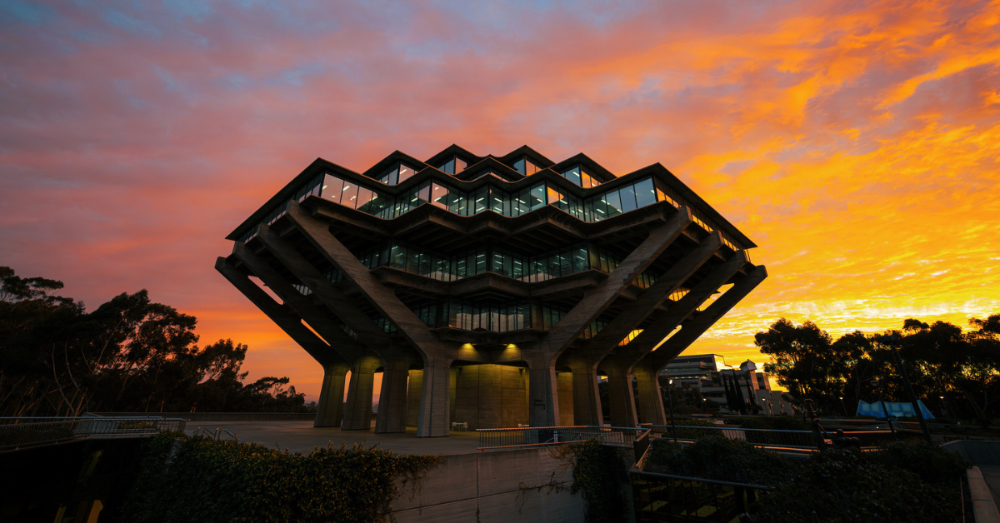

# Evan Marriott's User Page

## Table of Contents
- [Evan Marriott's User Page](#evan-marriotts-user-page)
  - [Table of Contents](#table-of-contents)
  - [About Me](#about-me)
  - [As a Programmer](#as-a-programmer)
  - [Outside of Code](#outside-of-code)
  - [Photos](#photos)

---

## About Me

Hi, I'm **Evan Marriott**, a CS student at *UC San Diego*.

> "First, solve the problem. Then, write the code."

---

## As a Programmer

My favorite language is **Python**. Here's a snippet I like:
```python
def greet(name):
    return f"Hello, {name}!"
```

Check out a project I'm building: [Series](https://series.so)

[Jump to Photos](#photos)

[View README](./README.md)

---

## Outside of Code

**Hobbies:**
- Basketball
- Video Games
- Listening to music 🎵

**Current courses:**
1. CSE 110
2. CSE 150B
3. CSE 132A

---

## Photos



[View image file](./assets/ucsd.jpg)